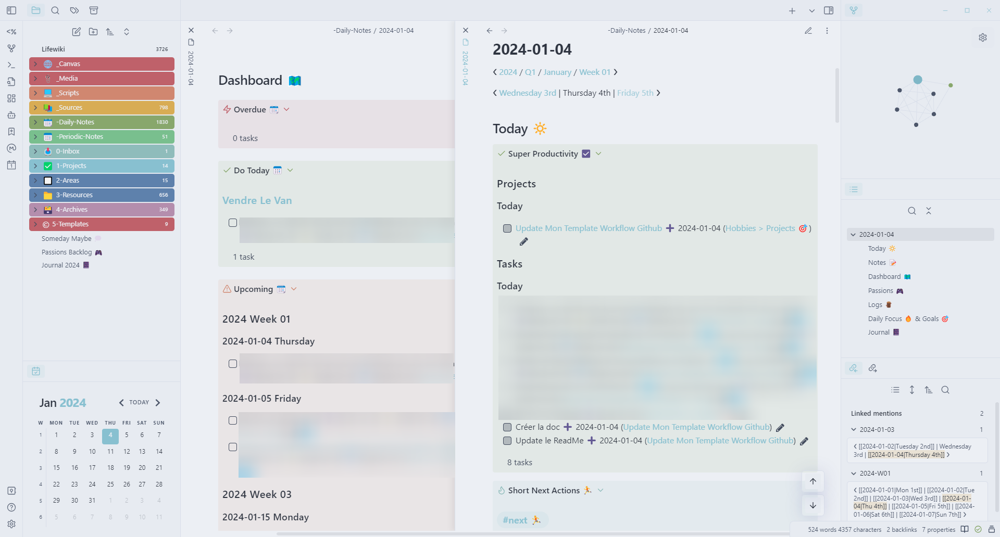

# README

## Introduction

As I promised to quite a few people on different places, I’m releasing my Obsidian workflow template. It has many cool features that I’ve seen people struggling with online :

1. Tasks and project management with journaling, workout logging and media tracking. Using daily and periodic notes.
2. Read-it-later with automated conversion to markdown and import inside your vault. Meaning all your past knowledge is inside Obsidian, available with a simple search alongside your notes.
3. Fast and simple one click upload obsidian publish alternative.

But there’s plenty more. It took me some time here and there during the past year to come up with this setup. And don’t worry, it is **easy to use** despite its awfully long name. But I’ll describe it with as much depth as I can for people who wants to fine tune it.

Obviously, it is merely just a starting point, with Obsidian you can (and you always should) do something that works well for **you**. And that means creating your **own** setup. But that doesn’t forbid you from using this one as a starting-point.

## Core Features

- 🎨 Beautiful design using [AnuPpuccin: Personal theme for Obsidian](https://github.com/AnubisNekhet/anuppuccin).
- 🗃️ [P.A.R.A](https://fortelabs.com/blog/para/)[^1] folder organisation based on file actionability.
- ✅ [GTD](https://gettingthingsdone.com/)[^2] task management on par with a [full Todoist setup](https://todoist.com/fr/productivity-methods/getting-things-done), but with a simple and natural way of **writing tasks alongside notes**. You also get to keep your project tasks, notes and files archives when you finish a project, allowing you to access these informations in the future.
- 📅 Daily notes for task management, periodic notes for projects management (week, month, quarter and year).
- 📓 Journal section for each daily and periodic notes to write about anything that happened during a certain period of time.
- 💪 Simple workout log for storing your workout sessions but with an infinite possible personalized exercise library.
- 🎮 Media backlog Kanban board for tracking books, shows, movies or video games backlog, consuming media at the right pace, and archiving what you do. All without proprietary online services that hold you data.
- 🔗 Read-it-later / bookmark manager with automated markdown conversion for offline storage inside your vault using [Omnivore app](https://omnivore.app/). That means easy search for knowledge inside your vault across sources and personal notes.
- 📝 [Zettelkasten note-taking](https://everlaab.com/methode-zettelkasten-comment-prendre-des-notes-utiles/) on a flat structure inside `3-Resources` folder.
    1. 📎 Import sources automatically using [obsidian-omnivore](https://github.com/omnivore-app/obsidian-omnivore) plugin for an automatic markdown conversion of a webpage or document online or manually from a file or using [markdownload](https://github.com/deathau/markdownload).
    2. Highlight and take reference notes using [Omnivore app](https://omnivore.app/) or directly inside your vault using a simple markdown file.
    3. Write literature notes to summarise the source informations.
    4. Write permanent notes from key concepts directly inside literature notes using wiki-links.
- 🌐 One click upload of file and attachments to a [Hugo](https://gohugo.io/) website hosted on [Github Pages](https://pages.github.com/) thanks to [obsidian-github-publisher](https://github.com/ObsidianPublisher/obsidian-github-publisher) plugin.

## Documentation

The documentation is available [here](https://mathisgauthey.github.io/obsidian-workflow-template-docs/).

If you want to modify it, feel free to help in the [docs repository](https://github.com/mathisgauthey/obsidian-workflow-template-docs).

## Support me

I believe in a world where every software has an open-source alternative maintained by a group of great people to improve everyone's life, and not a company seeking only profits with high margins.

That's why I open-source almost all my projects and try to help as much as possible the people who need help using these projects. Of course, all of this takes time, time that I'm willing to spend so that you can use all of this for free.

However, if you use my projects and find them useful, if you want to encourage me to continue creating stuff, or if you believe in the same ideal as I do, it is possible for you to support me to keep the machine running.

Thanks a lot, and make sure to have fun in life o/

